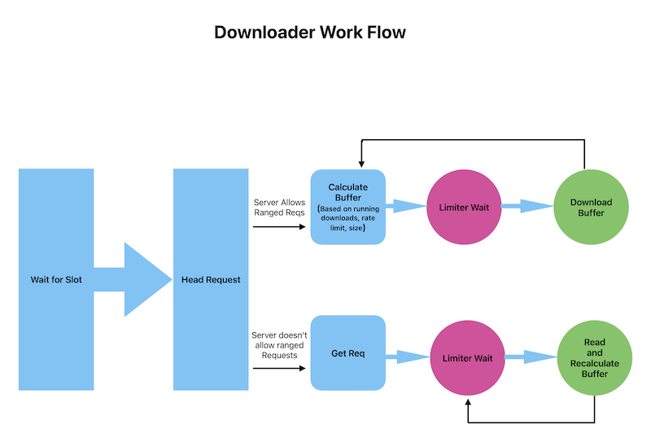

# Downloader package

Downloads a single file from a given URL to a specified destination path and exposes download status and current speed.

## Features
- Streams downloads directly to disk.
- Calls server with ranged get request if available.
- Continue dowload option.
- Exposes report functions to show download speed and current download status for each routine.
- Downloads to a temporary .part file and renames it upon successful completion.
- Handles concurrent downloads.
- Enforces a global rate limit supressing network bursts.
- Exposes analytics and final status for all and each download.

## Configs
| key | Type  | Description | Default |
| ----|-------|-------------|---------|
| `rate-limit`  | int64 | Limits the download speed (bytes/second). | 0 (no limit)|
| `max-downloaders` | int32 | Limits the number of concurrent downloader instances. | 20 |
| `no-overwrite` | bool| Prevents overwriting existing files.| false |
| `resume`| bool | Resume download. | false 
| `timestamping`| bool |Don’t re-retrieve files unless newer than local. | false|
|`retry-count`| int | Number of retries upon request failure. | 3|

You can create as many downloader instances as needed, but active threads are limited by the `max-downloaders` setting. Once the limit is reached, new download requests are blocked until a slot is available.

## Usage

Create an instance of downloader using: 
```go
NewDownloader(rawConfigs map[string]any, log LoggerFunc) (*Downloader, []string)
```   
Both arguments are optional — if either or both are nil, the downloader falls back to default values and function.  
With the instance returned call `Download` with a single URL and a destination path and filename as many times needed. Concurrent calls are fine and global rate limit will be applied.   
      
*Note: Accurate rate limit is dependant on server supporting range requests. If not the rate limited reader is still applied but actual network limit depends on limiting reads from OS Kernel buffer.*
### Rate Limit Diagram


Example ( main.go ):
```go
	package main

	import downloader "github.com/vstefanopoulos/downloader"
	
	func main() {
		// Create instance
		d, warnings := downloader.NewDownloader(rawConfigs, logger.Log)
		if err != nil {
			log.Fatal(err)
		}
	
		// Optional: log warnigs
		if len(warnings) > 0 {
			fmt.Println(warnings)
		}
	
		// Call download managers with URL and destination
		status, err := d.Download("www.example.com", "<dir>/<filename>")
		if err != nil {
			// handle err 
		}
		// Parse status to string and print
		fmt.Println(downloader.ParseStatus(status))
		
		// Check current download speed
		bytesPerSecond, err := d.CalculateAverageSpeed()
		if err != nil {
			// handle err
		}
	
		// Get the progress of all downloads
		statusJsonObj, err := d.ExposeStatusJSON()
		if err != nil {
			// handle err
		}
	
		// Get a copy of total statuses slice
		statusesSlice := downloader.ExposeStatus()
	
		// Reports the Average of read bytes from the beginnig of process until call time
		 speedInt64, err := download.GetAverageSpeed()
		if err != nil {
			// handle err
		}
	}
```

The status returned is an array of json objects marshaled from the struct below:
```go
// Represents the current download status
type downloadStatus struct {
	FileName   string     `json:"file_name"`
	StartAt    *time.Time `json:"start_at"`
	EndAt      *time.Time `json:"end_at"`
	StatusRes  string     `json:"status_res"`
	URL        string     `json:"url"`
	Filepath   string     `json:"filepath"`
	TotalBytes int64      `json:"total_bytes"`
	ReadBytes  int64      `json:"downloaded_bytes"`
	Err        string     `json:"error"`
}
```
## Dependencies

go 1.25.0
golang.org/x/time v0.14.0

## Contributing

Pull requests are welcome. For major changes, please open an issue first
to discuss what you would like to change.

Please make sure to update tests as appropriate.

## License

[MIT](https://choosealicense.com/licenses/mit/)

## Authors
- Vagelis Stefanopoulos
- Alexis Gioldaseas
- Katerina Vamvasaki